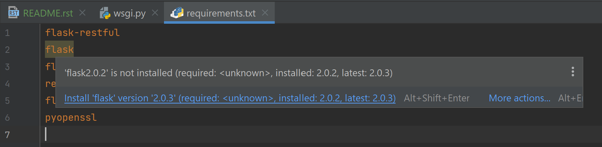
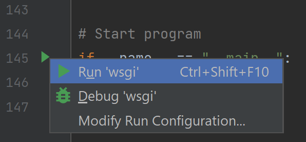

Command & Control server
#########################################

.. contents:: Contents
    :local:

Installation guide
*****************************************

- Install `Python <https://www.python.org/>`_
- Install `PyCharm <https://www.jetbrains.com/pycharm/>`_ community edition
- Open PyCharm
    - Create a new project ``Get from VCS`` and copy paste `this github repository URI <https://github.com/nergalex/f5-bot-selenium.git>`_
    - Attach a `Python interpreter <https://www.jetbrains.com/help/pycharm/configuring-python-interpreter.html>`_
- Download `here <https://sites.google.com/chromium.org/driver/>`_ same Chrome driver as your Chrome browser ``chrome://settings/help``
- OPTION: for other browser, follow `this guide <https://selenium-python.readthedocs.io/installation.html#installation>`_
- Copy downloaded ``chromedriver(.exe)`` file in ``./_files/chromedriver.exe`` of your project
- For MacOS only, allow ``chromedriver`` as described `here <https://stackoverflow.com/questions/60362018/macos-catalinav-10-15-3-error-chromedriver-cannot-be-opened-because-the-de>`_:

.. code-block:: bash

    xattr -d com.apple.quarantine chromedriver

- Open file ``requirements.txt``
- Click on  ``Install requirements``

Run
*****************************************

- In PyCharm, open ``wsgi.py``
- Go to the end of the file and click on the green triangle

